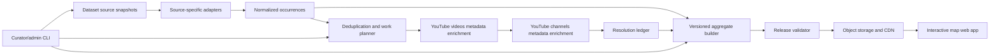
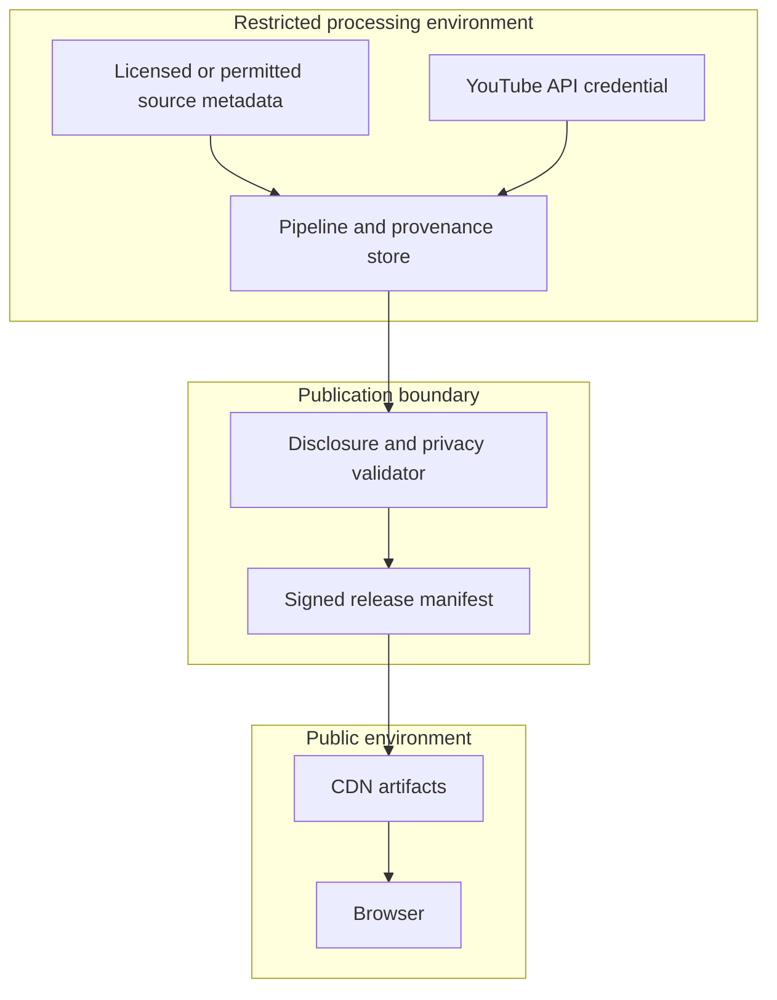
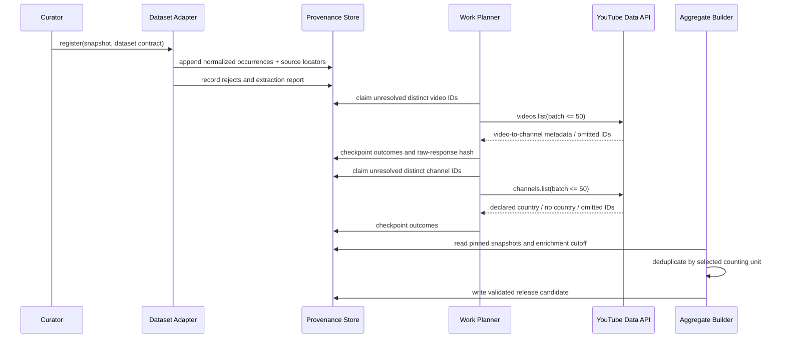
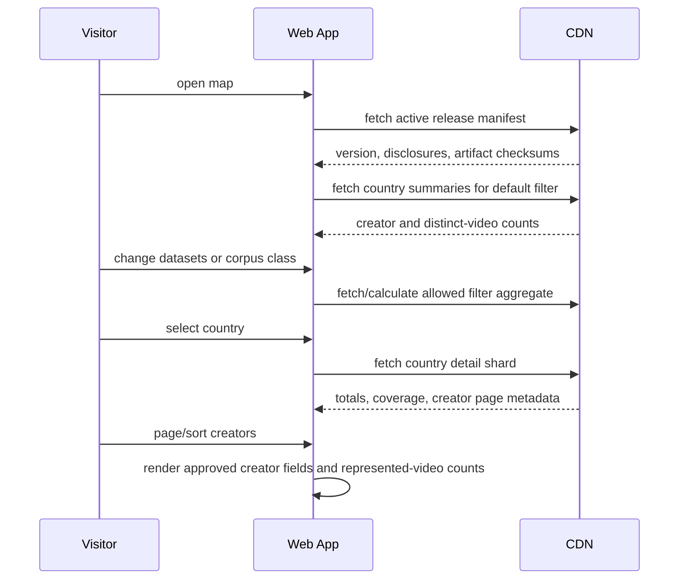

# Design Document: YouTube Creator Training Data Map

## Overview

The feature is a public, interactive world map that summarizes YouTube source-video identifiers found in selected AI-training dataset source materials and groups resolved creators by the country declared in their YouTube channel metadata. It follows the supplied reference's dark choropleth, headline metrics, country selection, and creator drill-down while making provenance, counting units, unresolved records, and dataset filters explicit.

The system does not infer copyright status, consent, residence, nationality, or infringement. Dataset membership means only that an identifier was observed in a documented source snapshot; country means the channel's declared country returned by the YouTube Data API at enrichment time. Consent-clean comparison corpora are visually separated and never used to imply that other corpora are non-consensual.

A greenfield, batch-first architecture separates reproducible ingestion and enrichment from the public application. Immutable source snapshots and normalized occurrence records feed cached, resumable YouTube metadata enrichment; versioned aggregate releases then power a static-first web interface without exposing raw API credentials or unnecessary record-level data.

## Design Goals and Non-Goals

**Goals**
- Preserve source-level and transformation-level provenance for every published aggregate.
- Distinguish source occurrences, distinct source videos, and creators to prevent clip inflation.
- Support dataset, corpus-class, country, and resolution-status filtering.
- Make partial coverage and unknown country visible rather than silently dropping records.
- Resume safely under API quotas and transient failures.
- Publish privacy-aware aggregates and a constrained creator drill-down.

**Non-goals**
- Downloading or redistributing videos, transcripts, thumbnails, or dataset media.
- Determining whether training occurred, whether use was lawful, or whether a creator consented.
- Inferring channel country from language, location text, IP data, or other indirect signals.
- Providing a creator contact directory, bulk raw-video export, or personal profile enrichment.

## Architecture



### Deployment Topology and Technology Choices

| Layer | Choice | Rationale |
|---|---|---|
| Public web application | Next.js static export, TypeScript, React | Accessible component model, pre-rendered shell, and CDN deployment; no public runtime API is required for normal browsing. |
| Map rendering | MapLibre GL JS with Natural Earth-derived country boundaries | Dark choropleth, keyboard-addressable country selection, and no proprietary map-token dependency. Boundary data must include license and version metadata. |
| Charts and details | Observable Plot or D3 primitives wrapped in accessible React components | Supports ranked creator lists and explicit textual/table alternatives. |
| Pipeline orchestration | Python batch jobs coordinated by Dagster | Strong tabular/data ecosystem, explicit assets, retries, partitions, and observable resumability. |
| Durable analytical store | PostgreSQL for job state and provenance; Parquet in S3-compatible object storage for immutable snapshots | Transactional leases/checkpoints plus inexpensive, reproducible bulk processing. |
| Aggregate build | DuckDB over versioned Parquet | Fast deterministic group-by and distinct-count computation without a standing analytics service. |
| Delivery | Versioned compressed JSON/GeoJSON manifests on object storage behind a CDN | Atomic release switching, cacheability, rollback, and low operational exposure. |
| Secrets and operations | Managed secret store, CI/CD with workload identity, curator CLI | API keys never enter artifacts or browser bundles; privileged operations remain non-public. |

The design permits equivalent managed services. Technology substitution must preserve immutable snapshots, deterministic releases, transactional work claims, cacheable public artifacts, and separation between restricted provenance data and public aggregates.

### Trust Boundaries



Only disclosure-reviewed aggregates, approved channel display fields, methodology text, and release metadata may cross the publication boundary. Raw source rows, raw API responses, credentials, job internals, and suppressed groups remain restricted.

## Sequence Diagrams

### Ingestion, Deduplication, and Enrichment



### Public Exploration



## Components and Interfaces

All formal interfaces use mathematical pseudocode; implementation types must preserve these contracts.

### Dataset Registry and Source Adapters

**Purpose:** Register each candidate source only after access/terms review, pin an immutable snapshot, and extract YouTube identifiers plus occurrence semantics without assuming all sources have media files.

```math
\begin{aligned}
DatasetContract = \{&id: DatasetId,\ displayName: String,\ version: String,\\
&corpusClass: Candidate \mid Comparison,\ sourceKind: MetadataOnly \mid MediaIndex \mid SubtitleIndex,\\
&accessStatus: Proposed \mid Approved \mid Blocked,\ snapshotDigest: Digest,\\
&adapterVersion: Version,\ occurrenceUnit: Clip \mid Timestamp \mid Segment \mid Row \mid Video,\\
&sourceCitation: URI,\ termsReviewId: ReviewId\}\\
SourceAdapter = \{&validate(Snapshot) \rightarrow ValidationReport,\\
&extract(Snapshot, DatasetContract) \rightarrow Stream(NormalizedOccurrence)\}
\end{aligned}
```

**Responsibilities:** Preserve source row/record locators; normalize valid YouTube video IDs; retain repeated clip/timestamp/segment occurrences; quarantine malformed records; emit no claim that the referenced media was downloaded or used for training.

The initial registry may contain Panda-70M, DISCO-12M, HD-VILA-100M, InternVid, HowTo100M, Koala-36M, YT-Temporal-1B, The Pile's YouTube Subtitles component, YouTube-Commons, and FineVideo. Inclusion in the registry is not publication approval: every dataset/version requires a documented source citation, acquisition path, occurrence semantics, and terms review.

### Identity Resolver and YouTube Enricher

```math
\begin{aligned}
IdentityResolver = \{&normalizeVideoId(RawId) \rightarrow Result(VideoId, RejectReason),\\
&distinctVideoWork(DatasetSnapshotSet) \rightarrow Set(VideoId)\}\\
YouTubeEnricher = \{&resolveVideos(Set(VideoId), Cutoff) \rightarrow Set(VideoResolution),\\
&resolveChannels(Set(ChannelId), Cutoff) \rightarrow Set(ChannelResolution),\\
&resume(JobId) \rightarrow JobSummary\}
\end{aligned}
```

Video requests are globally cached by video ID and API response version; channel requests are globally cached by channel ID. Dataset membership remains a many-to-many join in provenance tables. Omitted API IDs are recorded as `UnavailableUnclassified`; the system must not label them deleted or private unless an authoritative response explicitly supports that finer status.

### Aggregate Builder and Release Validator

```math
\begin{aligned}
Filter = \{datasets: Set(DatasetId),\ corpusClasses: Set(CorpusClass)\}\\
AggregateBuilder = \{&buildCountrySummaries(ReleaseInput, Filter) \rightarrow Set(CountrySummary),\\
&buildCountryDetails(ReleaseInput, Filter) \rightarrow Set(CountryDetail),\\
&buildCoverage(ReleaseInput, Filter) \rightarrow CoverageSummary\}\\
ReleaseValidator = \{&validateCounts(ReleaseCandidate) \rightarrow ValidationReport,\\
&validateDisclosure(ReleaseCandidate, Policy) \rightarrow ValidationReport,\\
&publishAtomically(ReleaseCandidate) \rightarrow ReleaseId\}
\end{aligned}
```

### Public Map Application

```math
\begin{aligned}
MapApplication = \{&loadRelease(ReleaseId) \rightarrow ViewState,\\
&setFilter(Filter) \rightarrow ViewState,\\
&selectCountry(CountryCode \mid Unknown) \rightarrow CountryDetailView,\\
&pageCreators(PageCursor, SortOrder) \rightarrow CreatorPage,\\
&showMethodology() \rightarrow DisclosureDocument\}
\end{aligned}
```

**Responsibilities:** Render the choropleth and equivalent table; show filter scope and data-release date; keep URL-addressable filter/country state; show coverage and unresolved counts beside headline metrics; provide keyboard, screen-reader, reduced-motion, and mobile support.

## Data Models

### Provenance and Normalized Occurrences

```math
\begin{aligned}
NormalizedOccurrence = \{&datasetId: DatasetId,\ snapshotDigest: Digest,\ sourceLocator: OpaqueLocator,\\
&videoId: VideoId,\ clipStart: Option(Time),\ clipEnd: Option(Time),\\
&occurrenceUnit: OccurrenceUnit,\ extractedAt: Instant,\ adapterVersion: Version\}\\
VideoResolution = \{&videoId: VideoId,\ status: Resolved \mid UnavailableUnclassified \mid Invalid,\\
&channelId: Option(ChannelId),\ observedAt: Instant,\ responseDigest: Option(Digest)\}\\
ChannelResolution = \{&channelId: ChannelId,\ status: Resolved \mid UnavailableUnclassified,\\
&displayName: Option(String),\ declaredCountry: Option(ISO3166Alpha2),\\
&observedAt: Instant,\ responseDigest: Option(Digest)\}
\end{aligned}
```

**Validation rules**
- `snapshotDigest`, `sourceLocator`, and `adapterVersion` are mandatory for every accepted occurrence.
- A source locator is stable within its snapshot but is not public by default.
- Clip bounds, when present, satisfy `0 ≤ clipStart < clipEnd`; they do not create additional represented-video counts.
- Country is accepted only from the channel metadata field and normalized to a supported ISO code; absent/unsupported values map to `Unknown`, never to a guessed country.
- Enrichment records are append-only observations. A release pins a single cutoff policy so changing channel metadata cannot mutate a historical release.

### Job State and Quota Ledger

```math
\begin{aligned}
WorkItem = \{&jobId: JobId,\ entityKind: Video \mid Channel,\ entityId: String,\\
&state: Pending \mid Leased \mid Succeeded \mid RetryableFailure \mid TerminalFailure,\\
&attempts: Natural,\ nextAttemptAt: Instant,\ leaseExpiresAt: Option(Instant),\\
&lastErrorClass: Option(ErrorClass)\}\\
QuotaLedger = \{date: Date,\ operation: String,\ requests: Natural,\ estimatedUnits: Natural\}
\end{aligned}
```

A unique constraint on `(entityKind, entityId, enrichmentPolicyVersion)` makes claims idempotent. Expired leases return to pending. Checkpoints occur after each API batch transaction, and operators can stop before a configured daily quota reserve is consumed.

### Public Aggregates

```math
\begin{aligned}
CountrySummary = \{&country: ISO3166Alpha2 \mid Unknown,\ creatorCount: Natural,\\
&representedVideoCount: Natural,\ sourceOccurrenceCount: Natural,\\
&resolvedVideoCount: Natural,\ unavailableVideoCount: Natural\}\\
CreatorSummary = \{&channelId: PublicChannelKey,\ displayName: String,\\
&country: ISO3166Alpha2,\ representedVideoCount: Natural,\\
&datasetBreakdown: Map(DatasetId, Natural),\ lastObservedAt: Date\}\\
CoverageSummary = \{&inputOccurrenceCount: Natural,\ distinctInputVideoCount: Natural,\\
&resolvedVideoCount: Natural,\ unavailableVideoCount: Natural,\\
&resolvedChannelCount: Natural,\ knownCountryChannelCount: Natural,\\
&unknownCountryChannelCount: Natural\}\\
ReleaseManifest = \{&releaseId: ReleaseId,\ generatedAt: Instant,\ enrichmentCutoff: Instant,\\
&includedSnapshots: Set(DatasetSnapshotRef),\ defaultFilter: Filter,\\
&artifactDigests: Map(Path, Digest),\ methodologyVersion: Version,\\
&disclosurePolicyVersion: Version\}
\end{aligned}
```

`representedVideoCount` always means distinct normalized YouTube video IDs within the active filter. `sourceOccurrenceCount` measures source rows/clips/timestamps/segments and is secondary. `creatorCount` means distinct resolved channel IDs with the selected country. Cross-dataset duplicates count once in combined totals but remain present once per dataset in dataset breakdowns; therefore dataset subtotals are not necessarily additive.

## User Experience and Visual Design

The landing view uses a near-black canvas, muted geographic borders, and a sequential accent scale for countries with known values. The title, concise neutral-language subtitle, release date, and active-filter label sit above headline cards for creators, distinct represented videos, countries, and resolution coverage. Color encodes the selected metric using quantile or logarithmic bins chosen from the active distribution; the legend always displays exact bin ranges and a separate style for no-data countries.

Hover or keyboard focus reveals a compact country preview. Click, Enter, or Space locks selection and opens a side panel (bottom sheet on small screens) containing creator count, distinct represented-video count, source occurrence count, resolution coverage, dataset breakdown, and a paginated creator list. Each creator row shows only approved public channel display name, represented-video count, per-dataset breakdown, and metadata observation date. The view does not expose unavailable raw video IDs or source locators.

`Unknown country` is a first-class summary card and table row outside the geographic map. Visitors can switch between map and sortable table, clear country selection, select datasets individually, toggle candidate versus comparison corpora, and open methodology/limitations from every view. Comparison corpora use distinct labels and filter treatment rather than moral or legal color semantics.

Accessibility requirements include WCAG 2.2 AA color contrast, patterns/text in addition to color, visible focus, semantic headings, keyboard-equivalent map controls via the country table, live announcements for filter changes, and no information available only on hover. Country naming and boundaries are presentation conventions documented with the boundary-data version; disputed territories are not used to infer channel location.

## Algorithmic Pseudocode

### Algorithm A: Normalize a Dataset Snapshot

```math
\begin{aligned}
&\mathbf{algorithm}\ NormalizeSnapshot(S, D)\\
&\mathbf{input}:\ snapshot\ S,\ approved\ dataset\ contract\ D\\
&\mathbf{output}:\ occurrences\ O,\ rejects\ R,\ report\ T\\
&\mathbf{pre}:\ digest(S)=D.snapshotDigest \land D.accessStatus=Approved\\
&\mathbf{post}:\ \forall o\in O,\ provenanceComplete(o) \land validVideoId(o.videoId)\\
&\mathbf{post}:\ |O|+|R|=recordsExamined(T)\\
&\mathbf{invariant}:\ after\ processing\ k\ records,\ each\ of\ the\ first\ k\ records\ is\ represented\ exactly\ once\ in\ O\cup R\\
&\\
&O\leftarrow\emptyset;\ R\leftarrow\emptyset\\
&\mathbf{for}\ r\in D.adapter.read(S)\ \mathbf{do}\\
&\quad x\leftarrow D.adapter.extractVideoId(r)\\
&\quad \mathbf{if}\ normalize(x)=Error(e)\ \mathbf{then}\\
&\qquad R\leftarrow R\cup\{reject(locator(r),e)\}\\
&\quad \mathbf{else}\\
&\qquad o\leftarrow occurrence(D,locator(r),normalize(x),clipBounds(r))\\
&\qquad O\leftarrow O\cup\{o\}\\
&\quad \mathbf{end\ if}\\
&\mathbf{end\ for}\\
&T\leftarrow summarize(O,R,S,D)\\
&\mathbf{return}\ (O,R,T)
\end{aligned}
```

The adapter does not deduplicate `O`; repeated records are evidence needed for occurrence counts and auditability.

### Algorithm B: Plan and Execute Resumable Enrichment

```math
\begin{aligned}
&\mathbf{algorithm}\ EnrichVideos(J,V,Q,C)\\
&\mathbf{input}:\ job\ J,\ distinct\ video\ IDs\ V,\ quota\ reserve\ Q,\ cache\ C\\
&\mathbf{output}:\ durable\ resolution\ set\ E\\
&\mathbf{pre}:\ |batch|\le 50 \land Q\ge 0\\
&\mathbf{post}:\ each\ v\in V\ is\ cached,\ terminal,\ retryable,\ or\ pending\\
&\mathbf{invariant}:\ no\ committed\ success\ is\ reverted\ by\ retry\\
&\mathbf{invariant}:\ each\ active\ lease\ belongs\ to\ at\ most\ one\ worker\\
&\\
&enqueueMissing(J,V,C)\\
&\mathbf{while}\ quotaRemaining()>Q \land pending(J)>0\ \mathbf{do}\\
&\quad B\leftarrow claimLease(J,50)\\
&\quad \mathbf{if}\ B=\emptyset\ \mathbf{then\ break}\\
&\quad \mathbf{try}\\
&\qquad A\leftarrow youtubeVideosList(ids(B))\\
&\qquad \mathbf{for}\ b\in B\ \mathbf{do}\\
&\qquad\quad \mathbf{if}\ b.id\in ids(A)\ \mathbf{then}\\
&\qquad\qquad commitResolved(b,channelId(A[b.id]),digest(A[b.id]))\\
&\qquad\quad \mathbf{else}\\
&\qquad\qquad commitUnavailableUnclassified(b)\\
&\qquad\quad \mathbf{end\ if}\\
&\qquad \mathbf{end\ for}\\
&\qquad checkpoint(J,quotaCost(A))\\
&\quad \mathbf{catch}\ e\\
&\qquad \mathbf{if}\ retryable(e)\ \mathbf{then}\ reschedule(B,backoff(e))\\
&\qquad \mathbf{else}\ markTerminal(B,classify(e))\\
&\qquad \mathbf{end\ if}\\
&\quad \mathbf{end\ try}\\
&\mathbf{end\ while}\\
&\mathbf{return}\ committedResolutions(J)
\end{aligned}
```

Channel enrichment is structurally identical, batches distinct channel IDs, requests the minimum fields required for display and declared country, and records `NoDeclaredCountry` as a resolved channel with `declaredCountry = None`. Rate-limit responses, network failures, and server failures are retryable with bounded exponential backoff and jitter; invalid credentials and policy blocks halt the job for operator action.

### Algorithm C: Build Filtered Country and Creator Aggregates

```math
\begin{aligned}
&\mathbf{algorithm}\ BuildAggregates(O,VRes,CRes,F,P)\\
&\mathbf{input}:\ occurrences\ O,\ video\ resolutions\ VRes,\ channel\ resolutions\ CRes,\ filter\ F,\ disclosure\ policy\ P\\
&\mathbf{output}:\ country\ summaries\ S,\ creator\ details\ D,\ coverage\ K\\
&\mathbf{pre}:\ snapshotsPinned(O) \land enrichmentCutoffPinned(VRes,CRes)\\
&\mathbf{post}:\ every\ published\ count\ is\ derived\ only\ from\ F\\
&\mathbf{post}:\ no\ creator\ failing\ P\ appears\ in\ D\\
&\mathbf{invariant}:\ adding\ occurrences\ of\ an\ already-seen\ (dataset,videoId)\ does\ not\ increase\ represented-video\ counts\\
&\\
&O_F\leftarrow\{o\in O\mid o.datasetId\in F.datasets\}\\
&V_F\leftarrow distinct\{o.videoId\mid o\in O_F\}\\
&J\leftarrow leftJoin(V_F,VRes,CRes)\\
&K\leftarrow coverage(O_F,V_F,J)\\
&\mathbf{for}\ c\in ISO3166\cup\{Unknown\}\ \mathbf{do}\\
&\quad J_c\leftarrow\{j\in J\mid country(j)=c\}\\
&\quad S[c].creatorCount\leftarrow |distinct\{j.channelId\mid j\in J_c\}|\\
&\quad S[c].representedVideoCount\leftarrow |distinct\{j.videoId\mid j\in J_c\}|\\
&\quad S[c].sourceOccurrenceCount\leftarrow |\{o\in O_F\mid o.videoId\in ids(J_c)\}|\\
&\quad \mathbf{for}\ h\in groupByChannel(J_c)\ \mathbf{do}\\
&\qquad d\leftarrow creatorSummary(h,F)\\
&\qquad \mathbf{if}\ disclose(d,P)\ \mathbf{then}\ D\leftarrow D\cup\{d\}\\
&\qquad \mathbf{end\ if}\\
&\quad \mathbf{end\ for}\\
&\mathbf{end\ for}\\
&\mathbf{return}\ (S,D,K)
\end{aligned}
```

Unknown-country creators contribute to overall and unknown totals but not to a geographic country. Unresolved videos contribute to coverage/unavailable metrics but not creator or country counts because no channel attribution is available.

### Algorithm D: Validate and Publish a Release

```math
\begin{aligned}
&\mathbf{algorithm}\ PublishRelease(X)\\
&\mathbf{input}:\ release\ candidate\ X\\
&\mathbf{output}:\ active\ release\ identifier\ r\ or\ validation\ failure\\
&\mathbf{pre}:\ X\ references\ immutable\ snapshots\ and\ pinned\ policy\ versions\\
&\mathbf{post}:\ active(r)\Rightarrow all\ artifacts\ match\ manifest\ digests\\
&\mathbf{post}:\ failure\Rightarrow previous\ active\ release\ remains\ active\\
&\\
&A\leftarrow validateArithmetic(X)\\
&P\leftarrow validateProvenance(X)\\
&D\leftarrow validateDisclosure(X)\\
&L\leftarrow validateLabelsAndMethodology(X)\\
&\mathbf{if}\ \neg(A.ok\land P.ok\land D.ok\land L.ok)\ \mathbf{then}\\
&\quad \mathbf{return}\ Failure(A,P,D,L)\\
&\mathbf{end\ if}\\
&r\leftarrow stageVersionedArtifacts(X)\\
&verifyDigests(r)\\
&atomicSwapActiveManifest(r)\\
&\mathbf{return}\ r
\end{aligned}
```

## Key Functions with Formal Specifications

### `normalizeVideoId`

```math
normalizeVideoId: RawId\rightarrow Result(VideoId,RejectReason)
```

- **Precondition:** Input may be a bare ID or supported YouTube URL form and is treated as untrusted text.
- **Postcondition:** Success returns one canonical syntactically valid video ID; failure returns a non-empty reason and emits no occurrence.
- **Purity:** Deterministic and side-effect free.
- **Loop invariant:** Not applicable.

### `claimLease`

```math
claimLease: JobId\times Natural\rightarrow Set(WorkItem)
```

- **Precondition:** `1 ≤ requestedSize ≤ 50`; caller is an authenticated worker.
- **Postcondition:** Returned items are distinct, lease expiry is in the future, and no unexpired lease for those items belongs to another worker.
- **Failure behavior:** Returns the empty set when no eligible work exists; it does not busy-wait.
- **Loop invariant:** If implemented by repeated claims, all previously claimed items remain unique and validly leased.

### `creatorSummary`

```math
creatorSummary: ChannelGroup\times Filter\rightarrow CreatorSummary
```

- **Precondition:** Every group member resolves to the same channel and has an occurrence in the filter.
- **Postcondition:** `representedVideoCount` equals the number of distinct video IDs; each dataset value equals distinct video IDs for that dataset.
- **Postcondition:** `representedVideoCount ≤ Σ datasetBreakdown` when cross-dataset duplicates exist, and equality otherwise.
- **Purity:** Does not mutate occurrences or enrichment observations.

### `disclose`

```math
disclose: CreatorSummary\times DisclosurePolicy\rightarrow Boolean
```

- **Precondition:** Policy is versioned and approved.
- **Postcondition:** `true` if and only if all configured publication conditions hold, including public-channel status, allowed fields, minimum-count/risk rules, and any documented opt-out/suppression record.
- **Privacy property:** A `false` result never writes creator-identifying fields to public artifacts or logs.

### `selectCountry`

```math
selectCountry: ViewState\times(CountryCode\mid Unknown)\rightarrow CountryDetailView
```

- **Precondition:** A verified release and active filter are loaded.
- **Postcondition:** Detail totals exactly match the selected country summary under the same filter and release.
- **Postcondition:** URL state, visible heading, map selection, and accessible table selection identify the same country.

## Example Usage

```math
\begin{aligned}
&D\leftarrow registry.approved(\{Panda70M,HowTo100M,YouTubeCommons\})\\
&F\leftarrow \{datasets:\{Panda70M,HowTo100M\},\ corpusClasses:\{Candidate\}\}\\
&\mathbf{for}\ d\in D\ \mathbf{do}\\
&\quad (O_d,R_d,T_d)\leftarrow NormalizeSnapshot(snapshot(d),d)\\
&\quad persist(O_d,R_d,T_d)\\
&\mathbf{end\ for}\\
&V\leftarrow distinct\{o.videoId\mid o\in \bigcup_d O_d\}\\
&E_V\leftarrow EnrichVideos(newJob(),V,dailyQuotaReserve(),videoCache())\\
&E_C\leftarrow EnrichChannels(newJob(),distinctChannelIds(E_V),dailyQuotaReserve(),channelCache())\\
&(S,C,K)\leftarrow BuildAggregates(\bigcup_d O_d,E_V,E_C,F,currentDisclosurePolicy())\\
&r\leftarrow PublishRelease(candidate(S,C,K,F))\\
&view\leftarrow MapApplication.loadRelease(r)\\
&detail\leftarrow view.selectCountry(\text{"DE"})
\end{aligned}
```

## Design Invariants

The invariants below are design-level candidates for property-based and release-validation tests. Because this is a design-first spec and requirements have not yet been derived, they intentionally carry no requirement-validation references. After requirements are accepted, each invariant can be promoted to a traceable correctness property without changing its technical meaning.

### Invariant 1: Normalization Idempotence

`∀x`, if `normalizeVideoId(x)=Success(v)`, then `normalizeVideoId(v)=Success(v)`.

### Invariant 2: Occurrence Conservation

For every completed snapshot extraction, `accepted occurrences + rejected records = examined source records`, subject only to an explicitly versioned adapter rule that can emit multiple occurrences from one source record; such a rule must report its expansion count separately.

### Invariant 3: Within-Dataset Deduplication

`∀d,v,n≥1`, adding `n` duplicate occurrences with the same `(d,v)` changes source-occurrence count by `n` but does not change distinct represented-video count.

### Invariant 4: Cross-Dataset Union Semantics

`∀F₁,F₂`, the distinct video set for `F₁∪F₂` equals `videos(F₁)∪videos(F₂)`; a video present in both contributes one to the combined total and one to each applicable per-dataset total.

### Invariant 5: Creator Attribution Uniqueness

For a pinned enrichment observation, every resolved video contributes to at most one channel, one declared-country bucket, and one creator's represented-video count.

### Invariant 6: No Inferred Country

`∀c`, if the selected channel observation has no valid declared-country value, then `country(c)=Unknown`; no other metadata can change that result.

### Invariant 7: Coverage Partition

For every filter, distinct input videos partition into resolved, unavailable-unclassified, retryable/pending, invalid, and terminal-failure states without overlap; their counts sum to the distinct input-video count.

### Invariant 8: Filter Isolation

`∀F`, every occurrence supporting a count rendered under `F` belongs to a dataset in `F.datasets`, and no excluded dataset can affect that count.

### Invariant 9: Monotonic Union of Resolved Identities

For filters `F₁⊆F₂` over the same release, `videos(F₁)⊆videos(F₂)` and resolved creator/video totals cannot decrease, while rates and averages may change non-monotonically.

### Invariant 10: Resumption Equivalence

Given the same API observations and cutoff, any sequence of worker interruption, lease expiry, and retry produces the same committed resolutions as uninterrupted execution.

### Invariant 11: Historical Immutability

Once published, a release's artifact digests and counts do not change when later API observations or source snapshots arrive.

### Invariant 12: Country-Detail Consistency

`∀country,filter,release`, the country panel's creator and represented-video totals equal the corresponding map/table summary totals.

### Invariant 13: Disclosure Noninterference

Suppressed creator details never appear in public artifacts, search indexes, client telemetry, error messages, or downloadable payloads; aggregate publication follows the same versioned policy.

### Invariant 14: Neutral Labeling

Every public dataset-membership statement uses approved observational language and no generated view converts membership into a claim of infringement, illegality, training completion, residence, nationality, or consent status.

### Invariant 15: Atomic Publication

At every observable instant, the active manifest points entirely to the previous verified release or entirely to the new verified release, never a mixture.

## Correctness Properties

**Promotion status:** Deferred pending requirements derivation.

The numbered Design Invariants above are the authoritative design-level correctness-property candidates. No invariant is promoted here and no `Validates: Requirements X.Y` reference is emitted because requirements and acceptance-criterion IDs do not yet exist in this design-first workflow. After requirements are created and accepted, applicable invariants will be promoted into traceable, requirement-linked correctness properties without changing their numbering or technical meaning.

## Error Handling

| Scenario | Handling | Public representation / recovery |
|---|---|---|
| Unsupported or malformed source record | Quarantine with dataset, snapshot, source locator, adapter version, and reason. Continue when record-level safe. | Include reject totals in extraction report; block release if thresholds or conservation checks fail. |
| Metadata-only source | Process documented identifiers without attempting media access. | Label source kind and available evidence in methodology. |
| Duplicate rows, clips, or timestamps | Retain occurrences; deduplicate only at declared aggregation boundaries. | Show distinct-video headline and optional occurrence count with definitions. |
| API omits a requested video/channel | Record `UnavailableUnclassified` with observation time. | Include in unresolved/unavailable coverage; do not guess deleted/private status. |
| Channel lacks declared country | Resolve channel with `country=None`. | Place in `Unknown country`, outside choropleth geography. |
| Temporary network/server/rate-limit failure | Roll back uncommitted batch, apply bounded exponential backoff with jitter, and retain retryable state. | Existing release remains available; operations dashboard shows backlog. |
| Daily quota reserve reached | Stop claiming new work and persist checkpoint. | Resume on operator action or quota-window reset; release coverage discloses cutoff. |
| Invalid/revoked API credential | Halt affected job and alert operator; never retry aggressively. | Existing release remains active. |
| Source schema drift | Adapter validation fails closed before occurrence publication. | Require a versioned adapter update and fresh extraction report. |
| Aggregate/provenance mismatch | Reject release candidate. | Active release remains unchanged; produce an internal reconciliation report. |
| Missing/corrupt CDN shard | Verify digest, retry fetch, then show a recoverable error and methodology link. | Never show zeros as if they were valid data. |
| Unsupported country code/boundary mismatch | Map to Unknown with diagnostic; do not coerce to a nearby country. | Country table and coverage remain usable. |
| Disclosure-policy failure or opt-out/suppression match | Exclude identifying detail before artifact generation and invalidate cached shards as policy defines. | Preserve only permitted aggregate behavior; document policy version without exposing the reason. |

## Testing Strategy

### Unit Testing

- Adapter fixtures for every approved dataset/version: bare IDs, URL variants, malformed values, clips/timestamps, repeated rows, and source locators.
- Canonical ID normalization, country-code normalization, unknown handling, error classification, backoff boundaries, and quota reserve behavior.
- Distinct-video, occurrence, creator, dataset-breakdown, and cross-dataset union calculations.
- Disclosure-policy field allowlist and suppression behavior.
- UI state reducer, URL serialization, quantile/log binning, number formatting, loading/error/empty states, and keyboard selection.

### Property-Based Testing

**Libraries:** Hypothesis for pipeline/aggregate properties and fast-check for TypeScript view-state/artifact consumers.

Generate arbitrary occurrence multisets, overlapping dataset filters, resolution partitions, countries (including unknown), worker interruption schedules, and release manifests. Exercise design invariants 1-13, with particular emphasis on duplicate invariance, set-union semantics, coverage partitioning, resumption equivalence, and absence of suppressed fields in recursively inspected public JSON.

### Integration and Contract Testing

- Run source adapters against pinned, minimal licensed/permitted fixtures and compare extraction reports to golden manifests.
- Use a fake YouTube API to test batches of 0/1/50 IDs, omitted IDs, pagination assumptions, quota exhaustion, retry headers, credential failures, and response-shape drift.
- Execute interrupted jobs against PostgreSQL to verify transaction boundaries, lease expiry, idempotency, and restart behavior.
- Build a complete release from synthetic data, verify all digests and count reconciliations, then load it through the web app.
- Validate public artifact schemas backward/forward compatibility before atomic manifest switching.

### End-to-End, Accessibility, and Visual Testing

- Verify default headline metrics, dataset filters, comparison-corpus toggle, map/table parity, country drill-down, creator pagination, unknown-country flow, and methodology disclosures.
- Use automated accessibility checks plus manual keyboard and screen-reader testing; verify 200% zoom, reduced motion, and non-color legend interpretation.
- Maintain visual regression baselines for dark desktop/mobile views, no-data countries, selected-country states, long channel names, and high-count formatting.
- Test degraded delivery: stale cache, missing shard, digest mismatch, offline navigation shell, and previous-release rollback.

### Release Acceptance Checks

Every release must pass arithmetic reconciliation, provenance completeness, disclosure-policy validation, neutral-language lint/review, artifact schema validation, checksum verification, accessibility smoke tests, and curator sign-off on dataset/version citations and terms review.

## Performance Considerations

- Deduplicate IDs before API requests and cache identities across datasets/releases; only stale or policy-required observations are refreshed.
- Use the API's supported batch maximum (up to 50 IDs per request where applicable) and request only required metadata fields. Actual quota costs and limits are configuration validated against current official documentation before operation, not hard-coded assumptions.
- Partition occurrences and Parquet outputs by dataset snapshot; cluster work/provenance indexes by entity ID and status.
- Precompute common filter combinations (all candidates, each dataset, all comparison corpora). For arbitrary selections, ship compact per-dataset/per-country bitmaps or additive distinct-ID sketches only if exactness is preserved; otherwise serve prebuilt exact shards for supported combinations.
- Keep initial map payload below a defined performance budget (target: compressed manifest plus country summaries ≤ 250 KiB). Lazy-load country detail shards and paginate creator lists.
- Target CDN-cached map interaction under 100 ms after artifact load and Largest Contentful Paint under 2.5 s at the 75th percentile on a representative mobile profile.
- Bound worker concurrency by quota budget and API response signals. Database leases prevent duplicate workers from amplifying requests.
- Version all artifacts with immutable cache headers; keep only the small active-manifest pointer short-lived.

## Security Considerations

- Store YouTube API credentials only in a managed secret store; use least-privilege workload identities and prohibit secrets in logs, CI artifacts, source files, and browser bundles.
- Restrict source snapshots, raw API responses, source locators, and provenance joins to the processing environment with role-based access, encryption in transit/at rest, retention limits, and audited access.
- Treat dataset files and metadata as untrusted: validate schemas, cap field/record sizes, reject path traversal, avoid formula execution, and sandbox decompression/parsing against archive bombs.
- Do not download media as part of enrichment. Allow outbound network access only to approved API endpoints and object storage.
- Sign or checksum release manifests and verify artifact digests before activation and in the browser loader where practical.
- Serve the static app with a restrictive Content Security Policy, Subresource Integrity for externally hosted assets when applicable, strict transport security, no inline secret-bearing configuration, and dependency vulnerability scanning.
- Avoid third-party behavioral analytics. If operational telemetry is necessary, collect coarse events without channel IDs, video IDs, free text, precise location, or stable visitor identifiers.
- Apply rate limits and authentication to curator/admin tools; no mutation endpoint is public.

## Legal, Ethical, and Privacy Publication Policy

Public copy must state that the project reports identifiers observed in named dataset source materials and channel metadata observed at a particular time. It must not state or imply that a creator's work was unlawfully copied, that a model definitely trained on a video, that channel country is residence/nationality, or that membership proves consent or lack of consent. Dataset citations, snapshot/version, source kind, caveats, and methodology are linked from the map.

Although channel names and declared countries may be public metadata, combining them creates new discoverability risks. The publication boundary therefore uses a versioned policy with field minimization, configurable minimum group/detail thresholds, exclusion of raw video IDs and source locators, no contact information, no sensitive-trait inference, no search-engine indexing of creator detail shards where feasible, and a documented correction/opt-out/suppression review path. Small-group rules must be selected through stakeholder/privacy review before launch; the system fails closed until they are configured.

Headline totals always include visible coverage context: input occurrences, distinct IDs, resolved videos/channels, unavailable-unclassified IDs, unknown-country channels, enrichment cutoff, and active filter. Comparison/control corpora are labeled according to their documented provenance and permissions; they are not represented as a legal judgment about other datasets.

## Dependencies

### External Services and Data

- YouTube Data API access approved for the enrichment purpose, with current quota policy and terms reviewed before each operational launch.
- Permitted, version-pinned metadata/index sources for each approved candidate dataset.
- Permitted, version-pinned sources for YouTube-Commons and FineVideo comparison corpora.
- Versioned Natural Earth-derived or equivalent country boundaries with attribution/license metadata.
- S3-compatible object storage, CDN, PostgreSQL, managed secret store, and workload monitoring.

### Application and Pipeline

- Next.js, React, and TypeScript for the static-first web application.
- MapLibre GL JS for map rendering; accessible HTML table/list equivalents remain authoritative alternatives.
- Observable Plot or constrained D3 modules for detail charts.
- Python, Dagster, DuckDB, PostgreSQL client/migrations, PyArrow, and schema-validation libraries for processing.
- Hypothesis, fast-check, browser end-to-end tooling, and accessibility test tooling.

Dependency versions must be pinned through lockfiles during implementation, licenses reviewed, and supply-chain/security scanning enforced. No dependency is added solely to retrieve or redistribute video media.

## Design Decisions and Trade-offs

1. **Batch/static over live API:** Country and creator exploration reads versioned public artifacts, avoiding API credentials, quota coupling, latency, and visitor-driven metadata collection. The trade-off is freshness, addressed by visible release/cutoff dates.
2. **Distinct source videos as headline unit:** This avoids inflating counts from clips, timestamps, subtitles, or duplicate source rows. Occurrence counts remain available as clearly secondary provenance metrics.
3. **Current observation, immutable release:** Channel country can change. Append-only observations and pinned cutoffs preserve reproducibility without claiming historical truth.
4. **Unknown rather than inference:** Missing country reduces geographic coverage but avoids unreliable and privacy-invasive guesses.
5. **Exact set semantics over additive totals:** Dataset overlap means subtotals cannot simply be summed. Exact distinct-ID unions are preferred; approximations are not used for public headline counts.
6. **Static creator shards with policy gate:** This enables drill-down without a public database, but only approved fields cross the publication boundary. Policy can suppress detail while retaining allowed aggregates.
7. **Candidate registry is not automatic inclusion:** Source availability, legal access, format, and semantics vary. Dataset/version adapters and reviews are explicit prerequisites rather than assumptions.
